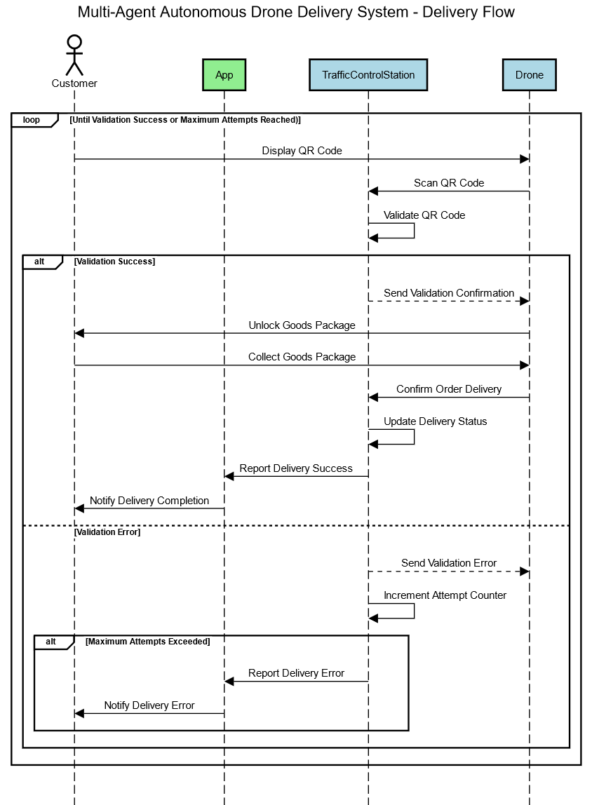

# MEIA-PROJ4: Multi-Agent Autonomous Drone Delivery System 

This README provides an overview of the Autonomous Drone Delivery System project, which aims to revolutionize the delivery industry through the use of autonomous drones and a sophisticated multi-agent system. The project utilizes ROS2, Gazebo, and PX4 to create a fully automated and coordinated drone delivery system.

## Proposed Solution

### Overview
The proposed solution introduces a transformative approach to revolutionize the delivery industry by harnessing the potential of autonomous drones and a sophisticated multi-agent system. The architecture primarily comprises a fleet of drones dedicated to efficient and timely deliveries, supported by strategically positioned charging stations to meet their recharging needs. This integrated system holds the promise of significant advancements in the delivery sector. At the core of the system, two control stations serve as the multi-agent system, overseeing the coordination of drone operations and managing the diverse negotiations involved.

### Traffic Control Station
The Traffic Control Station holds a pivotal position within the multi-agent autonomous drone delivery system, being responsible for facilitating efficient coordination and management of drone operations. Its primary function is to oversee the flow of traffic and ensure the smooth operation of the delivery system, by receiving the location and delivery status information from each Drone.

This station enables drones to make local decisions based on their perception of the environment and shares relevant information among the agents. By providing a centralized point for coordination, the Traffic Control Station enhances the responsiveness, adaptability, efficiency, and scalability of the overall delivery system. It enables effective route optimization, collision avoidance, and resource allocation among the drones and serves as a crucial mediator in negotiating and resolving conflicts or collisions that may arise during the delivery operations.

### Charging Control Station
Comprising a network of strategically positioned charging stations, the Charging Control Station plays a vital role in ensuring the uninterrupted availability of charged drones for efficient delivery operations. This station is responsible for managing the charging infrastructure and resources within the delivery system. It analyzes the availability of charging stations and allocates charging spots to drones based on their battery levels and charging requirements. This control station acts as a central coordination point, facilitating efficient resource allocation and optimizing the utilization of charging stations.

When a drone's battery level reaches a low threshold, it communicates its charging request to the Traffic Control Station, which forwards it to the Charging Control Station. In cases where a charging spot is available, the charging control station allocates the spot to the requesting drone, instructing it to proceed to the designated location. Throughout the process, the Charging Control Station plays a crucial role in monitoring the charging status of drones, ensuring effective management and coordination. It tracks the progress of charging operations, checks the availability of charging stations and corresponding spots, while maintaining a transparent overview of the system's overall charging capacity. This oversight allows for efficient utilization of charging resources and enables seamless coordination within the delivery system.

### Delivery and Ordering
The delivery and ordering processes in the autonomous drone system involve interactions among multiple agents and coordination with the Traffic Control Station and Charging Control Station. The detailed flows for delivery and ordering can be found in the provided diagrams.

#### Delivery Flow:

#### Ordering Flow:

## Running the Project

To run the ROS2 PX4 Multi-Agent System Workspace, please refer to the [ROS2 PX4 Multi-Agent System Workspace Setup Guide](./Setup/run_workspace_guide.md) for detailed instructions.

## Video Demonstration
A video demonstration of the project can be found on YouTube at the following link: [Project Demonstration](https://www.youtube.com/watch?v=3jpfwbAEnbg)

For any further inquiries or support, please feel free to reach out.

## License

This project is licensed under the MIT License. See the [LICENSE](LICENSE) file for more information.
